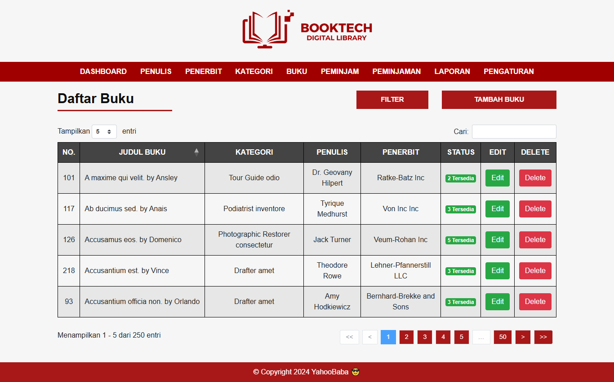
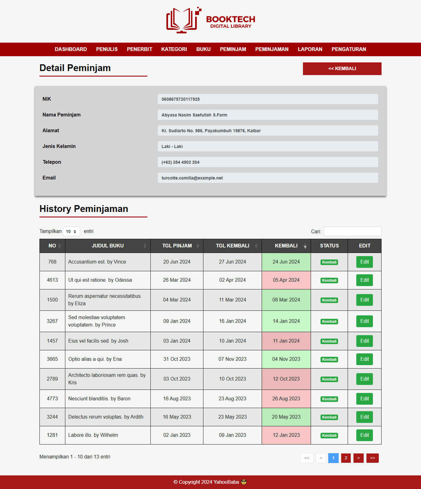
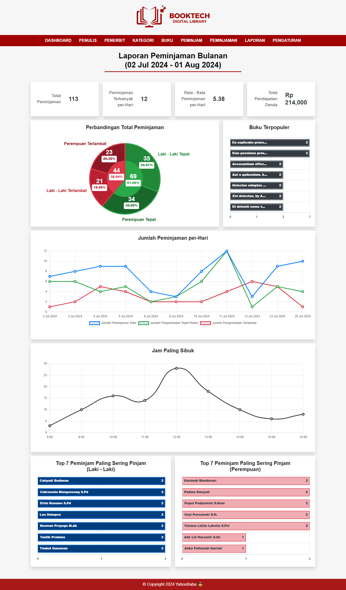

<p align="center"><a href="https://laravel.com" target="_blank"></a></p>

# Laravel Library Management System
This Laravel project originally created by [tauseedzaman](https://github.com/tauseedzaman/). I then modified and added several things, like book amounts, reports with charts and visualization, and language change (to fit with my course assignment)

## Quick Start 
Clone the repository
```
git clone https://github.com/tauseedzaman/Laravel-libraray-management-system
```
or
```
git clone https://github.com/Joko-P/Laravel-libraray-management-system-edited
```

Change current directory
```
cd Laravel-libraray-management-system
```

Install dependencies
```
composer install
````

Install js dependencies
```
npm install && npm run dev
````

Create .env file
```
cp (unix) or copy (Windows) .env.example .env
```

Generate env key
```
php artisan key:generate
```

Migrate the migration and seed the database
```
php artisan migrate:fresh --seed
```

Start server
```
php artisan serve
```

credentails
```
username: tauseedzaman
password: password
```
or
```
username: Joko_P
password: password
```

## Features
For original and complete features, you can look at the [tauseedzaman's repository](https://github.com/tauseedzaman/Laravel-libraray-management-system) description. Here I will only list the changes and modifications I've made on this Laravel project. Some of them are :

### 1. Book with amount in inventory system
<p align="center">
    
</p>
This adds an amount of book that are available in the library. This means, when a book has at least 1 in the library, it can be borrowed. If book also has more than 1, then it can also be borrowed by more than 1 visitor/borrower. But when the book has 0 left in the library, then it will no longer visible/showed up when you want to create a new book issuing.

### 2. More detailed view about the borrower/visitor
<p align="center">
    
</p>
This adds table below the basic visitor data that shows the history of what books they borrowed in the past. It also shows on what day they returned it and has either red or green background to show whether they returned it on time or late.

### 3. Reports with charts and visualization
<p align="center">
    
</p>
This is also one of the changes where you can get a visualization of the data on certain time frame (weekly, monthly, or yearly).

### Misc
- Table now use Datatable.js where you can search and sort the data on almost every table.
- Table scheme is now properly constrained, so you can't delete a book or borrower when they already borrowed once, preventing from error.
- Input validator on visitor data with successful and error message when executed.
- Language changed to Indonesia

### Things that can be improved/added if you want to
Even though I did modify some, I also noticed that there are some things that can be improved from here. Some that I noticed are :
- Actually do paginate when showing data and making the search and filter server side, not client side. I noticed when I have 6000 data of book issue, I loaded all of them. This makes your system load for quite a long time. This is definitely not very optimal and can be improved.
- Actual language settings. This is also something that possible and can be done, alongside with settings for timezone and currency symbol.

```
Make sure to leave a star ✨
```
